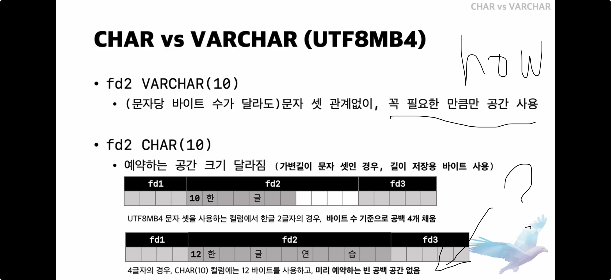
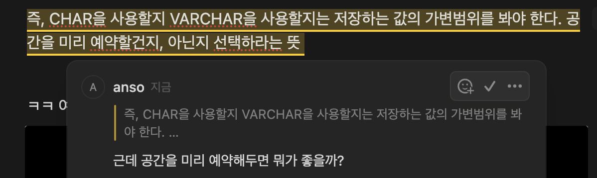
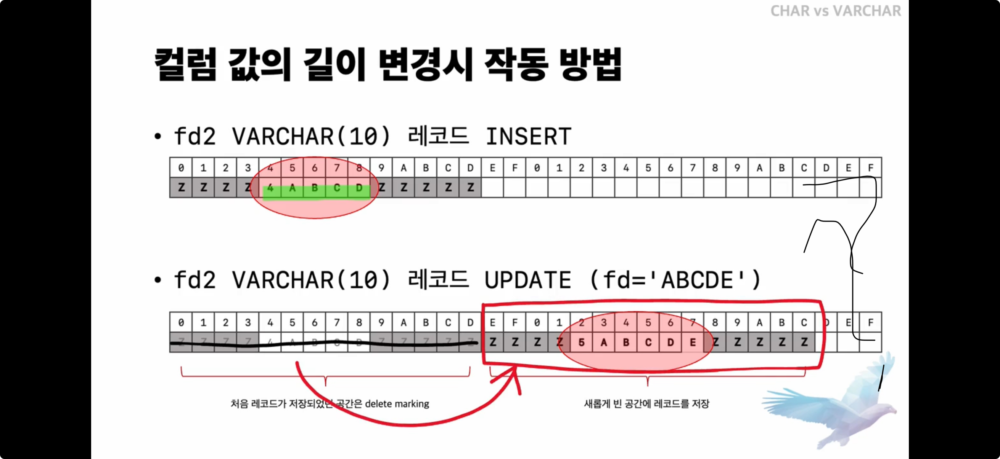

## 01. CHAR vs VARCHAR

CHAR와 VARCHAR 모두 문자열을 저장하는데 쓰이는 타입이다. 

일반적인 상황에서 차이점은 다음과 같다. 

| CHAR | VARCHAR |
| --- | --- |
| 지정한 크기만큼 저장 공간을 할당 | 저장되는 문자열의 길이만큼 저장 공간을 할당 |
| 저장된 값의 길이 관리 X | 저장된 값의 길이를 관리함(1~2byte) |
---

그렇지만 UTF8MB4 같이 가변 길이 문자셋을 사용할 때는 CHAR도 저장된 값의 길이를 관리한다.

  
왜 가변길이 문자셋일때는 CHAR도 길이를 관리해야 할까?

  
  

    
가변길이 문자셋

    <ul>
      <li>문자에 따라 다른 바이트 수를 차지하는 문자셋</li>
      <li>예: UTF-8, UTF8MB4 등</li>
    </ul>
  

1. CHAR은 남는 공간을 공백으로 패딩처리하는데 가변 길이 문자셋은 실제로 차지하는 바이트수가 일정하지 않아서 적절한 패딩처리를 하려면 길이 관리가 필요하다.

2. CHAR은 ORDER BY나 INDEX를 사용할 때 비교를 위해서 저장된 문자열의 정확한 길이를 알아야한다. 이때 가변 길이 문자셋을 사용하면 같은 길이의 CHAR여도 문자에 따라 바이트 수가 달라지므로 길이를 별도로 관리해야함.

3. 길이를 관리하지 않으면 한칸이 몇 바이트인지 매번 계산해야해서 성능이 떨어짐

  

가변 길이 문자셋일 때는 가장 앞에 문자열 길이를 저장해두고 기본적으로는 지정한만큼 저장공간을 예약하고 안쓰면 빈공간으로 두는데, 이걸 넘어서는 값을 저장하게 되면 빈공간없이 저장하게 됨.

즉, CHAR을 사용할지 VARCHAR을 사용할지는 저장하는 값의 가변범위를 봐야 한다. 공간을 미리 예약할건지, 아닌지 선택하라는 뜻 

ㅋㅋ 여기까지오면 

이렇게 의문이 들 수 있는데 그렇다면 예약 공간이 주는 장점을 알아보자. 

VARCHAR에서는 저장했던 값을 업데이트할 때 값의 길이가 변하면 원래 레코드가 저장되어 있던 위치에 그대로 다시 저장할 수가 없다. 따라서 다시 저장할 공간을 탐색해야한다. 

이렇게 공간에 빈구멍을 자꾸내다며보면 compaction을 해야만 저장할 수 있는 공간을 찾을 수 있게 된다. CHAR처럼 예약공간을 두면 레코드의 위치를 옮길 필요없이  그 자리에 그대로 업데이트할 수 있다는 장점이 있다. 

이제부터는 CHAR을 선택할지, VARCHAR을 선택할지 결정할 때 

1. 값의 가변 길이 범위가 넓은지 좁은지
2. 값이 자주 변경되는지

를 기준으로 선택하도록 하자. 

(1 → 범위가 좁다.) + (2 → 그렇다) 라면 CHAR을 선택-!