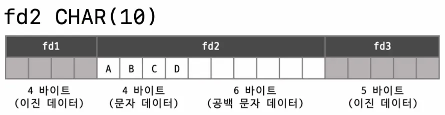
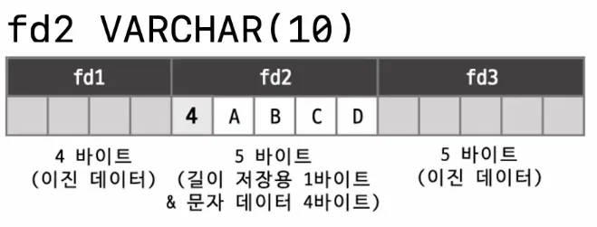
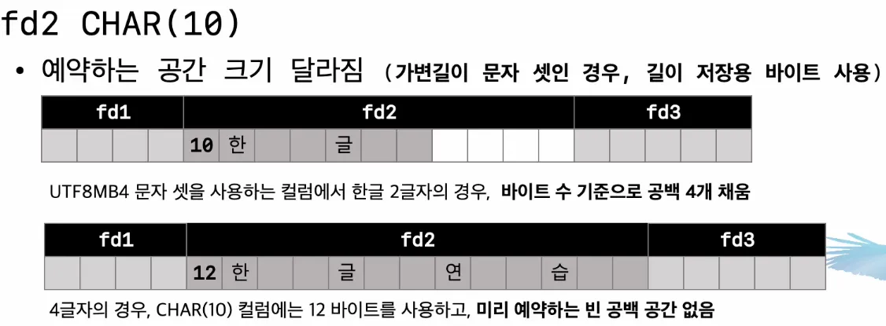
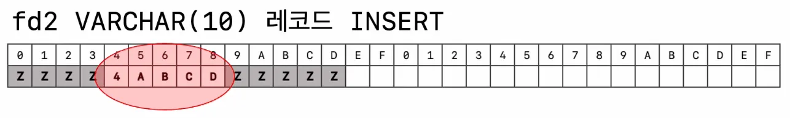
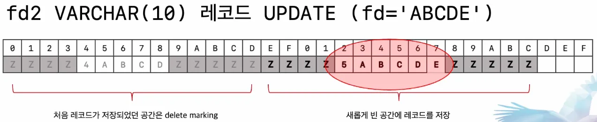

# 01. CHAR vs VARCHAR

MySQL 서버에서 문자열 값을 저장하는 컬럼의 타입으로는 CHAR와 VARCHAR가 존재한다.

## CHAR와 VARCHAR 의 공통점

- 문자열을 저장하는 데이터 타입
    - 두 타입 모두 문자열 데이터를 저장하는 컬럼의 데이터 타입으로 사용된다.
- 최대 길이를 명시해야한다.
    - CHAR와 VARCHAR 모두 저장할 수 있는 최대 문자 개수를 지정해야 한다.
    - 💡 여기서 지정하는 길이는 **문자 개수** 이며, 바이트 단위가 아님!
    - 저장 공간의 크기는 문자셋(Character Set)에 따라 달라진다.

> "지금까지 컬럼 길이를 10으로 설정하면, 한글이든 숫자든 영어든 무조건 10자만 저장되고 끝인 줄 알았는데, 문자셋에 따라 실제 저장 바이트 크기는 달라지는 것이었다.”
>

### 문자셋(Character Set)에 따른 저장 공간 차이

- 지정한 문자 개수만큼 항상 같은 바이트를 사용하는 것이 아니라, **문자셋에 따라 저장되는 실제 바이트 크기가 달라질 수 있다**.
- 예를 들어, 최대 10글자를 저장할 수 있도록 컬럼을 만든 경우
    1. **Latin1 문자셋 (고정길이 문자셋)을 사용하는 경우** → Latin1 문자셋 : ASCII를 포함하는 상위 문자셋
        - Latin1 문자셋을 사용하면, 모든 문자가 1바이트 크기를 가지므로 저장 공간이 예측 가능하다.
        - ex. 최대 10글자를 저장하면 10바이트가 필요
        - 하지만 라틴 1 문자만 저장 가능함
    2. **UTF-8 mb4 문자셋 (가변 길이 문자셋)을 사용하는 경우**
        - UTF-8 mb4 문자셋을 사용하면, 한 글자는 1~4바이트를 사용할 수 있음
        - 최대 10글자를 저장하더라도, 저장하는 글자의 종류에 따라 최소 10바이트에서 최대 40바이트까지 차지 가능
            - 영어 알파벳(ASCII 문자)은 1글자당 1바이트 → 10글자 저장 시 10바이트 사용
            - 한글을 1글자당 3바이트 → 10글자 저장 시 30바이트 사용
            - 이모지는 1글자당 4바이트 → 10글자 저장 시 최대 40바이트 사용

### 왜 한글은 3바이트, 이모지는 4바이트 인가? → 코드가 그렇단다.

```java
String hangeul = "한"; // 한글 한 글자
String emoji = "😊"; // 이모지 한 글자

byte[] hangeulBytes = hangeul.getBytes(StandardCharsets.UTF_8);
byte[] emojiBytes = emoji.getBytes(StandardCharsets.UTF_8);

System.out.println("한글 UTF-8 인코딩된 바이트 배열: " + Arrays.toString(hangeulBytes));
// [-19, -107, -100]

System.out.println("한글 바이트 수: " + hangeulBytes.length); 
// 3

System.out.println("이모지 UTF-8 인코딩된 바이트 배열: " + Arrays.toString(emojiBytes));
// [-16, -97, -104, -128]

System.out.println("이모지 바이트 수: " + emojiBytes.length);
// 4
```

## CHAR와 VARCHAR 의 차이점

- **고정 길이 vs 가변 길이**
    - **CHAR**: 지정된 길이에 맞춰 **항상 고정된 공간을 할당**
    - **VARCHAR**: 저장하는 값의 실제 길이에 따라 **가변적으로 공간을 할당**
- **최대 저장 길이**
    - **CHAR**: 최대 **255자** 저장 가능
    - **VARCHAR**: 최대 **16,383자** 저장 가능 (최대 65,535바이트).
- **저장된 값의 길이 관리 여부**
    - **CHAR**: 고정 길이이므로 별도로 길이를 저장하지 않음.
    - **VARCHAR**: 저장된 값의 길이를 관리하기 위해 추가적인 **길이 바이트(length-bytes)**를 사용.
        - 0 ~ 255 바이트 → **1바이트**로 길이 저장
        - 256 ~ 65,535 바이트 → **2바이트**로 길이 저장

## CHAR vs VARCHAR 저장 방식 (라틴1 기준)

### **1. CHAR 저장 방식**



- **CHAR는 지정된 크기만큼 고정된 공간을 예약**함
- 예를 들어, **CHAR(10) 컬럼**에 `"ABCD"`(4글자)를 저장하면 **10바이트가 예약**됨
- 남은 6바이트는 **패딩(공백) 처리됨**
    - 예시 (CHAR(10), 라틴1 문자셋)
    - `"ABCD"` 저장 → **10바이트 예약 (4바이트 사용 + 6바이트 패딩)**

### **2. VARCHAR 저장 방식**



- **VARCHAR는 저장된 값의 실제 길이만큼만 공간을 사용**함
- 💡하지만, **추가적인 길이 바이트(length byte)**가 필요함
    - 0~255 바이트 → **1바이트로 길이 저장**
    - 256~65,535 바이트 → **2바이트로 길이 저장**
    - (참고) 위 사진에서 VARCHAR 타입의 길이 저장 바이트가 컬럼 앞에 저장된다고 표시됐지만, 실제로는 더 복잡한 구조로 저장된다.

## CHAR vs VARCHAR 저장 방식 (UTF-8 MB4 기준)

### **1. CHAR 저장 방식**



- **UTF-8 MB4**에서는 한 글자가 최대 4바이트를 사용함
- 예를 들어,
  `CHAR(10)` 컬럼에 한글 2 글자를 저장하면 한글은 3바이트씩 사용하므로 6바이트가 저장되고 나머지 공간을 패딩처리함.
  `CHAR(10)` 컬럼에 한글 4 글자를 저장하면 실제 12 바이트의 저장공간이 필요하기 때문에 빈 공간을 만들지 않음
- CHAR 타입이더라도 UTF-8 MB4와 같은 가변길이 문자셋을 사용하는 경우 예약해두는 빈 공간이 단순히 **부족한 글자 수만큼이 아니며** 때로는 예약된 빈 공간이 아예 없을 수도 있음.
  → 이런 특성으로 VARCHAR와 조금 비슷하게 작동될 수 있음!
- 가변길이 문자셋인 경우 CHAR 타입 이더라도 실제 저장된 문자의 값이 사용하는 바이트 수가 별도로 저장되어야함. (그림의 컬럼 앞에 위치한 `10`, `12` 와 같이)

### 2. VARCHAR 저장 방식

- 문자당 바이트 수가 달라져도 문자셋 관계 없이, 꼭 필요한 만큼만 공간 사용
- `VARCHAR(10)`이라면, 최대 10개의 문자를 저장할 수 있지만, **저장된 실제 데이터의 길이만큼만 공간을 사용**

## CHAR 타입의 공간 낭비

- **길이가 긴 문자열의 경우**:
    - 예를 들어, 문자열의 길이가 100글자 정도인 경우, `CHAR(100)` 타입을 사용하면, 실제 값이 50글자만 들어가도 나머지 40글자는 공백으로 **채워지게** 됨
    - 이 경우, **공백으로 낭비되는 공간**이 60바이트가 될 수 있음
- **길이가 짧은 문자열의 경우**:
    - 예를 들어, 문자열 길이가 10글자 정도인 경우, `CHAR(10)`을 사용하면 나머지 공간이 공백으로 채워져 **10바이트** 정도의 낭비가 발생

> 고정된 문자열을 저장하는 경우에는 CHAR 타입을 사용하고 길이가 가변인 문자열을 저장할 때에는 VARCHAR 타입을 사용해야하는거 아닌가?
>
- 고정된 문자열에 CHAR 대신 VARCHAR를 사용한다면?
    - 저장되는 문자열의 최소 최대 길이 **가변 폭이 큰 경우** CHAR 타입의 공간 낭비가 심함
    - 저장되는 문자열의 최소 최대 길이 **가변 폭이 적은 경우** CHAR 타입의 공간 낭비는 크지 않음

## 컬럼 값의 길이 변경시 작동 방법

### **1. VARCHAR 타입 처리**

- **초기 상태**:
    - `FD2` 컬럼이 `VARCHAR` 타입으로 정의되어 있고, `"ABCD"`라는 문자열이 저장되어 있음



- **업데이트**:
    - 문자열이 `"ABCDE"`로 업데이트 될 때, MySQL 서버는 레코드의 길이가 바뀌었음을 감지하고 **인플레이스로 업데이트**할 수 없다고 판단함
        - **인플레이스(in-place) :** 현재 위치에서 직접 작업을 수행하는 방식
    - MySQL 서버는 **새로운 공간을 찾아 레코드를 이동**시키는데, 데이터 페이지에 빈 공간이 충분히 남아 있으면 문제 없이 이동되지만, 데이터 페이지가 꽉 차게 되면 레코드를 **컴팩션**하여 빈 공간을 만들고, 그 후에 새로운 레코드를 저장함
      - 조각난(fragmented) 공간을 정리하여 빈 공간을 확보하는 과정 



- **데이터 페이지 내 레코드 이동**:
    - MySQL 서버는 **새로운 공간을 찾아 레코드를 이동**시킴
    - 이때 데이터 페이지에 빈 공간이 충분히 남아 있으면 문제 없이 이동되지만, 데이터 페이지가 꽉 차게 되면 레코드를 **컴팩션**하여 빈 공간을 만들고, 그 후에 새로운 레코드를 저장함

### 2. **CHAR 타입 처리**:

- **초기 상태**:
    - `FD2` 컬럼이 `CHAR(10)` 타입으로 정의되어 있고, `"ABCD"`라는 문자열이 저장되어 있음
- **업데이트**:
    - 문자열이 `"ABCDE"`로 늘어나더라도, 미리 예약된 공간 내에서 데이터를 저장하면 되므로 레코드의 위치를 옮겨야 할 가능성이 낮아져 인플레이스 업데이트가 가능
    - 💡 `CHAR` 타입은 고정 길이이므로 **공간 낭비가 있지만** 업데이트 시 레코드 이동을 최소화하는 장점이 있음
      업데이트가 발생해도 **데이터 페이지의 구조 변경 없이** 미리 예약된 공간 내에서 데이터가 저장됨

# 💡 그러면 문자열 타입 선정을 어떻게 해야할까?

값의 길이가 가변인 경우 무조건 CHAR 대신 VARCHAR를 사용한다는 기준은 잊어버리고 상황에 따라 알맞게 사용해야함

### 값의 길이가 가변인 경우 VARCHAR 보다 CHAR 를 선택해야하는 경우

- 값의 가변 길이 범위 폭이 좁을 때
- 자주 변경되는 값을 때(특히 인덱스된 컬럼의 경우)
- 이럼에도 불구하고 VARCHAR를 사용하게되면
    - 데이터 페이지 내부적으로 플레그멘테이션(새로운 공간을 찾아 이동) 현상이 심해지고 공간을 미리 예약해주는 CHAR 타입보다 공간 효율이 나빠질 가능성이 있음
    - 공간을 확보하기 위해서 데이터 페이지의 조각 모음 작업이 필요해지고 성능이 떨어질 수 있다.